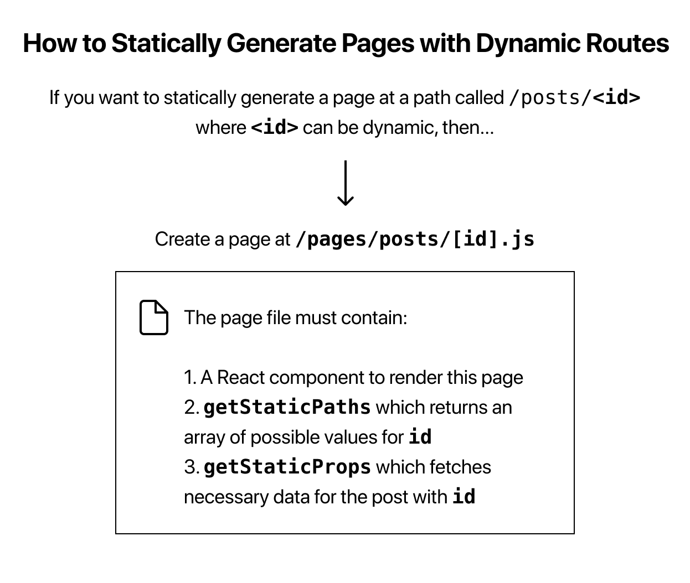

# 公式ドキュメントのチュートリアルをやってみる

## First Lesson

Next.jsのアプリケーションの作成とローカルサーバーの立ち上げまで

1. 下記コマンドでNext.jsの雛形をインストール

   ```bash
   npx create-next-app nextjs-blog --use-npm --example "https://github.com/vercel/next-learn/tree/master/basics/learn-starter"
   ```

1. 開発サーバーを立ち上げ。下記コマンドを実行するとサーバーが立ち上がる。localhost:3000にアクセス

   `cd nextjs-blog`のち`npm run dev`

1. pagesディレクトリ下のjsを編集すると変更が反映される

## Second Lesson

### 別のページを作成、またLinkを作成して、別ページへの遷移を試す

1. pagesディレクトリ内にpostsというディレクトリを作成し、その中にfirst-post.jsというファイルを作成する

1. first-post.js内に下記のように記述する。また、exportはdefaultでないとだめ

   ```JavaScript
   export default function FirstPost() {
     return <h1>First Post</h1>;
   }
   ```

1. その上でhttp://localhost:3000/posts/first-postにアクセスする

1. Nextが用意しているLinkコンポーネントを使用する。
   Linkコンポーネントは\<a>タグをラップする部品
  index.jsにimportする

   ```JavaScript
   import Link from 'next/link'
   ```

1. index.jsのtitleのところを下記のように変更する
   Readの後にある{' '}は半角スペースを入れるための記述

   ```JavaScript
   <h1 className="title">
     Read{' '}
     <Link href="/posts/first-post">
       <a>this page!</a>
     </Link>
   </h1>
   ```

1. なんでわざわざ`<Link>`を使うのか？
   `<Link>`を使うことでページを遷移した時に変更箇所のみが更新され、簡単にSPAを実現することができる。`<a>`を使ってしまうと、ページが遷移した時にページが完全に更新されてしまう
   また、Linkコンポーネント内のリンク先のデータを予め事前読み込みするため、遷移が高速になる！
   外部先のリンクへはaタグを使おう

### 画像を使う

1. 画像などのリソースはpublicディレクトリに入れておけば使える

1. publicディレクトリ下にimagesディレクトリを作成。その中に画像を入れる

1. Next.jsの用意している`<Image>`コンポーネントを使用することで画像を最適化してくれる

## メタデータ

1. メタデータを記述するのは通常`<head>`タグ内だが、Next.jsが用意している`<Head>`コンポーネントを使う

## CSSを使う

1. このチュートリアルファイルではCSS-in-JSで書かれているが、他の記法もサポートしている

## レイアウトコンポーネントを作る

1. 一番上の階層に`components`ディレクトリを作成

1. `components`ディレクトリに`layout.js`を作成

1. `layout.js`内にLayoutコンポーネントを記述

   ```JavaScript
    export default function Layout({ children }) {
      return <div>{children}</div>;
    }
   ```

1. `first-post.js`にLayoutコンポーネントを読み込み、全体を囲む

   ```JavaScript
   export default function FirstPost() {
    return (
      <Layout>
        <Head>
          <title>First Post</title>
        </Head>
        <h1>First Post</h1>
        <h2>
          <Link href="/">
            <a>Back to home</a>
          </Link>
        </h2>
      </Layout>
    );
   }
   ```

1. Layoutコンポーネントに対してスタイリングする
   今回はCSS Modulesを使用する。
   `components`ディレクトリ下に`layout.module.css`を作成
   下記を記述する

   ```CSS
   .container {
      max-width: 36rem;
      padding: 0 1rem;
      margin: 3rem auto 6rem;
    }
   ```

1. layout.js内でさきほど作成した`.container`クラスを適用させる
   `layout.module.css`を読み込み、適用

   ```JavaScript
   import styles from './layout.module.css';

   export default function Layout({ children }) {
     return <div className={styles.container}>{children}</div>;
   }
   ```

1. CSS Modulesを使用するとユニークなクラス名を自動的に生成してくれるので、名前衝突を避けられる

### グローバルのスタイルを適用させるためにトップレベルのコンポーネントを作成する

1. CSS Modulesはコンポーネントレベルのスタイルには適しているが、全ページ共通のスタイルを適応させるならトップレベルのコンポーネントを作成し、そこに共通のCSSを読み込ませるのが良い

1. `pages`ディレクトリ下に`_app.js`を作成する

1. `_app.js`に下記のように記述

   ```JavaScript
   export default function App({ Component, pageProps }) {
     return <Component {...pageProps} />;
   }
   ```

1. **global CSSは`pages/_app.js`の中でのみ読み込む**
   **そうしないと遷移先のページで意図しない挙動となる**

1. ルートディレクトリに`styles`ディレクトリを作成、`global.css`を作成。適当にCSSを編集する

1. `pages/_app.js`に`global.css`を読み込む
   `import '../styles/global.css';`

## Pre-rendering（事前レンダリング）について

Next.jsは全てのページを事前にレンダリングする。
これはSEO的に有利だし、ブラウザでJavaScriptが無効になっていても表示されるメリットがある

また、Pre-renderingの方法は2つある。
Static Generationはビルドの段階でHTMLファイルを生成
Server-Side Renderingはアクセス時にHTMLファイルが生成される

プレーンのReactで作ったページはpre-renderingされないので、JavaScriptを無効にしていたらコンテンツが表示されない

さらにNext.jsはページごとにSSGかSSRか選ぶことができる

- SSGとSSRの使い分け
公式はSSGを推奨している
めちゃくちゃ更新しまくるページはSSRでも良いかもだが、若干遅い

## SSGで外部データを取得する手法

外部からデータを引っ張ってきて、そのデータを取得してからサイトをビルドする事ができる

`async`キーワードを用いて`getStaticProps`を使うことで可能となる

## 外部データの取得をやってみる

1. ルートディレクトリに`posts`ディレクトリを作る

1. `posts`ディレクトリに`pre-rendering.md`と`ssg-ssr.md`を作る

1. 公式ドキュメントにある内容をそれぞれのmdにコピーする

1. gray-matterをインストールする
   `npm install gray-matter`

1. ルートディレクトリに`lib`ディレクトリを作り、その中に`posts.js`を作成

1. `posts.js`に下記を記述する

   ```JavaScript
   import fs from 'fs'
   import path from 'path'
   import matter from 'gray-matter'

   // 実行したカレントディレクトリとpostsを結合して変数に格納
   const postsDirectory = path.join(process.cwd(), 'posts')

   export function getSortedPostsData() {
   // Get file names under /posts
   const fileNames = fs.readdirSync(postsDirectory)
   const allPostsData = fileNames.map(fileName => {
      // Remove ".md" from file name to get id
      const id = fileName.replace(/\.md$/, '')

      // Read markdown file as string
      const fullPath = path.join(postsDirectory, fileName)
      const fileContents = fs.readFileSync(fullPath, 'utf8')

      // Use gray-matter to parse the post metadata section
      const matterResult = matter(fileContents)

      // Combine the data with the id
      return {
         id,
         ...matterResult.data
      }
   })
   // Sort posts by date
   return allPostsData.sort(({ date: a }, { date: b }) => {
      if (a < b) {
         return 1
      } else if (a > b) {
         return -1
      } else {
         return 0
      }
   })
   }
   ```

1. `pages/index.js`内で`getSortedPostsData`を読み込む
`import { getSortedPostsData } from '../lib/posts';`

1. `getStaticProps`を定義し、その中で`getSortedPostsData`を使用

   ```JavaScript
   export async function getStaticProps() {
   const allPostsData = getSortedPostsData();
   return {
      props: {
         allPostsData,
      },
   };
   }
   ```

1. `Home`コンポーネントにallPostsDataを読み込んで使用する

   ```JavaScript
   export default function Home({ allPostsData }) {
   return (
      <Layout home>
         <Head>
         <title>{siteTitle}</title>
         </Head>
         <section className={utilStyles.headingMd}>
         <p>[Your Self Introduction]</p>
         <p>
            (This is a sample website - you’ll be building a site like this on{' '}
            <a href="https://nextjs.org/learn">our Next.js tutorial</a>.)
         </p>
         </section>
         <section className={`${utilStyles.headingMd} ${utilStyles.padding1px}`}>
         <h2 className={utilStyles.headingLg}>Blog</h2>
         <ul className={utilStyles.list}>
            {allPostsData.map(({ id, date, title }) => (
               <li className={utilStyles.listItem} key={id}>
               {title}
               <br />
               {id}
               <br />
               {date}
               </li>
            ))}
         </ul>
         </section>
      </Layout>
   );
   }
   ```

## Dynamic Routes（動的なルーティング）

外部データから生成したページにパスを付与することができる

  


1. `pages/posts`内に`[id].js`を作成する。下記を記述

   ```JavaScript
   import Layout from '../../components/layout';

   export default function Post() {
   return <Layout>...</Layout>;
   }
   ```

1. `lib/posts.js`に`getAllPostsIds`関数を記述する

   ```JavaScript
   export function getAllPostIds() {
   const fileNames = fs.readdirSync(postsDirectory)

   // Returns an array that looks like this:
   // [
   //   {
   //     params: {
   //       id: 'ssg-ssr'
   //     }
   //   },
   //   {
   //     params: {
   //       id: 'pre-rendering'
   //     }
   //   }
   // ]
   return fileNames.map(fileName => {
      return {
         params: {
         id: fileName.replace(/\.md$/, '')
         }
      }
   })
   }
   ```

1. `pages/posts/[id].js`内で`getStaticPath`を呼び出す。また、その中で`getAllPostIds`を使用する

   ```JavaScript
   import { getAllPostIds } from '../../lib/posts'

   export async function getStaticPaths() {
   const paths = getAllPostIds()
   return {
      paths,
      fallback: false
   }
   }
   ```

1. `lib/posts.js`内に`getPostData`関数を追記する
   これはidを受け取って、投稿データを返却する関数

   ```JavaScript
   export function getPostData(id) {
   const fullPath = path.join(postsDirectory, `${id}.md`)
   const fileContents = fs.readFileSync(fullPath, 'utf8')

   // Use gray-matter to parse the post metadata section
   const matterResult = matter(fileContents)

   // Combine the data with the id
   return {
      id,
      ...matterResult.data
   }
   }
   ```

1. `pages/posts/[id].js`に`getPostData`を読み込むために変更を加える

   ```JavaScript
   import { getAllPostIds, getPostData } from '../../lib/posts'

   export async function getStaticProps({ params }) {
   const postData = getPostData(params.id)
   return {
      props: {
         postData
      }
   }
   }
   ```

## Markdownファイルをレンダリングする

1. remarkライブラリをインストールする
`remark remark-html`

1. `lib/posts.js`内にremarkとremark-htmlをimportする

## 公式ドキュメント

[npx create\-next\-app nextjs\-blog \-\-use\-npm \-\-example "https://github\.com/vercel/next\-learn/tree/master/basics/learn\-starter"](https://nextjs.org/learn/basics/create-nextjs-app/setup)