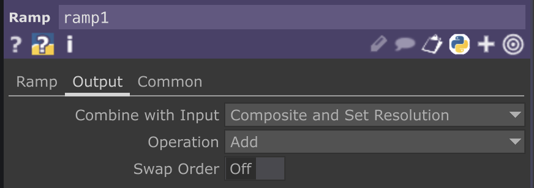

# Noise CHOPでオブジェクトを作る！

Noise CHOPのChannelタブ内、Channel Namesにほしい数のチャンネルを書く

`tx ty tz`

正規表現を使って、下記のようにもかける

`t[xyz]`

PalletにMy Conponents入れたい。

色が暗い。。
rampのOutputのoperationがmultiplyになっていた

## 参考

<https://www.youtube.com/watch?v=IgZZnwl4DLo&list=PLH6Y6o7cLK9hKBP7q3pgrvBuVCJRn71wi&index=6>
