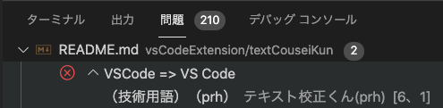
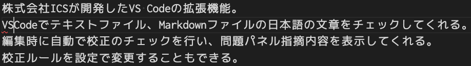

# テキスト校正くん

## テキスト校正くんとは

株式会社ICSが開発したVS Codeの拡張機能。
VSCodeでテキストファイル、Markdownファイルの日本語の文章をチェックしてくれる。
編集時に自動で校正のチェックを行い、問題パネル指摘内容を表示してくれる。
校正ルールを設定で変更することもできる。

## 例

本来は「VS Code」が正しいが、「VSCode」と入力した場合

問題パネルで指摘が表示される

該当箇所には赤い波線が表示される

## 参考

- [文章作成・メール作成に役立つ！　VS Codeの拡張機能「テキスト校正くん」を公開 \- ICS MEDIA](https://ics.media/entry/18859/)